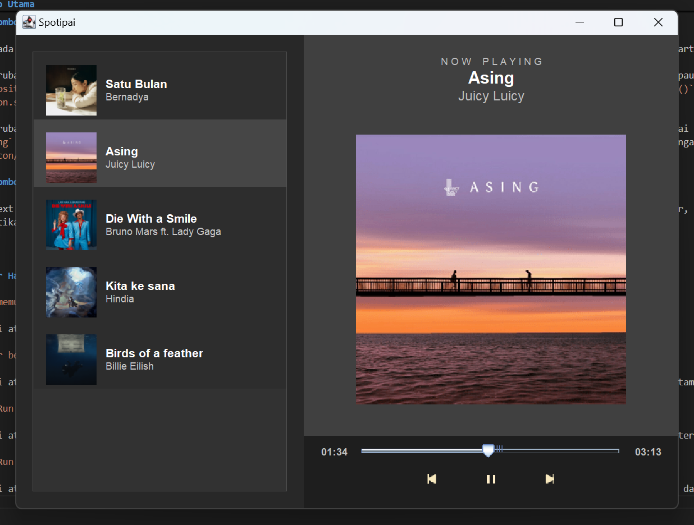

[](https://classroom.github.com/a/eU5SAiej)
[](https://classroom.github.com/a/2E6y6Jk9)
# Modul 4: Thread

## Deskripsi

Modul ini mengeksplorasi penggunaan Thread dalam pemrograman berorientasi objek (OOP) menggunakan Java. Dalam proyek ini, dibuat sebuah music player yang dapat
memainkan lagu bertipe .wav, menampilkan progress bar lagu yang dapat dinavigasikan, dan mengambil daftar lagu dari database MySQL.
## Konsep Utama

### 1. Pemasangan Driver JDBC dan Koneksi ke Database

Untuk pemasangan Driver JDBC, cukup import file `mysql-connector-j-9.1.0.jar` ke dalam referenced library dalam Java Project, kemudian koneksi ke database dapat dilakukan dengan mengimport library `import java.sql.*;` dan menggunakan kode
```
Connection conn = DriverManager.getConnection("jdbc:mysql://localhost:3306/pbomodul4", "root", "");
```
Di mana `jdbc:mysql://localhost:3306/pbomodul4` artinya menggunakan database mysql, di localhost dengan port 3306 dan nama tabelnya pbomodul4. `root` adalah nama usernya, dan password yang digunakan kosong.

### 2. Menambahkan data dan mengambil data dari database

Pada database harus dibuat dahulu tabel `lagu` yang berisi `id, title, artist, songPath, thumbnailPath`. Kemudian database tersebut diisi dengan 5 buah lagu, dengan data sebagai berikut:


Untuk mengambil data dari database, dilakukan melalui query. Dibuat terlebih dahulu sebuah `Statement` yang akan mengeksekusi query. Kemudian hasilnya disimpan di dalam sebuah `ResultSet`. `ResultSet` inilah akan dilooping sampai baris terakhir untuk mengambil data-data detail lagu yang akan dimasukkan ke dalam sebuah ArrayList, di mana ArrayList tersebut nantinya akan diubah ke dalam bentuk JList.

### 3. Cara Memutar Lagu

Lagu diputar melalui `ActionListener` dari button play atau dengan menggunakan method `playSelectedSong()`. Lagu dapat diputar dengan memilih salah satu lagu dari daftar-daftar lagu yang ada di panel sebelah kiri. Ketika salah satu lagu dipilih, maka method `playSelectedSong()` akan berjalan. Method tersebut mengambil lagu dari JList, menghentikan lagu yang sedang diputar, mengupdate UI (gambar, title, artist) mengikuti lagu yang mau diputar, dan memutar lagu menggunakan `SwingWorker`, yaitu Thread bawaan Swing yang memungkinkan melakukan tugas tertentu di background tanpa mengganggu UI agar tetap responsif. Audio diputar via `Clip` dan `timer` diupdate tiap 100 milidetik untuk mengupdate slider dan waktu berjalan. Ketika suatu lagu selesai diputar, maka lagu berhenti dan akan memutar lagu berikutnya.

Jika melalui `ActionListener`, lagu dipilih dari `JList`, jika belum ada yang diputar, maka buat `Thread` baru untuk memutar lagu. File audio dibuka menggunakan `AudioInputStream` dan diputar menggunakan `Clip`. Posisi terakhir diputar jika lagu dipause (`pausedPosition`), `timer` dipakai untuk memperbarui slider dan durasi lagu, sinkronisasi thread dilakukan pakai objek `lock` yang menghindari race condition. Jika tombol pause ditekan ketika lagu sedang diputar, maka musik dipause, posisi terakhir disave, dan timer distop, icon diubah ke play. Jika ada thread pemutar lagu yang aktif, tapi dihold, mkaa thread tersebut diaktifkan dengan `lock.notify()`. 

### 4. Cara Mengetahui Durasi yang Sudah Berjalan dan Durasi Total Lagu

Durasi lagu dapat dihitung melalui kode ini:
```
long durationInMicroseconds = audioClip.getMicrosecondLength();
long durationInMillis = durationInMicroseconds / 1000;  
```
Kode di atas mengambil durasi lagu dalam microdetik, kemudian diubah ke dalam milidetik. Durasi itu diguanakan untuk mengatur value maksimum dari slider dan menampilkan durasi total lagu. 

Untuk mengetahui durasi lagu yang sudah berjalan, dapat diperoleh dari
```
long currentPosition = audioClip.getMicrosecondPosition() / 1000;
```
Posisi saat ini digunakan untuk mengupdate posisi slider dan durasi lagu yang sudah berjalan.

### 5. Cara Kerja Progress Bar (Slider)

Slider dapat digunakan untuk melihat lagu sudah diputar sampai mana, dan dapat juga digunakan untuk melakukan navigasi ke bagian tertentu dari lagu. Berikut ini adalah kode untuk implementasinya:
```
songSlider.addChangeListener(e -> {
    if (songSlider.getValueIsAdjusting()) {
        long newPositionInMillis = songSlider.getValue();
        if (audioClip != null) {
            audioClip.setMicrosecondPosition(newPositionInMillis * 1000);
            if (isPlaying) {
                SwingUtilities.invokeLater(() -> playButton.setIcon(new ImageIcon("./res/images/icon/pause.png")));
            }
            pausedPosition = newPositionInMillis * 1000;
        }
    }
});
```
Jadi ada eventListener `ChangeListener` untuk mendeteksi perubahan nilai pada slider. Jika slider digeser, maka baca nilai baru dari slider, kemudian jika audio tidak null (berarti sedang memutar sesuatu), atur posisi pemutaran lagu ke posisi slider yang baru tadi. Kemudian update UI, jika lagu sedang diputar, maka tombol play berubah jadi pause, kemudian posisi pause yang baru dicatat sesuai dengan posisi baru dari slider.  

### 6. Tombol Play dan Pause

Karena pada asset yang disediakan, hanya ada tombol play, tidak ada tombol pause, maka saya buat sendiri tombol pausenya dengan pixel art. 

Untuk perubahan dari play ke pause, ketika suatu lagu sedang diputar (`isPlaying==true`), maka tombol ketika ditekan dianggap sebagai pause. Audio akan berhenti (`audioClip.stop()`), posisi terakhir disimpan dalam `pausedPosition`, kemudian `isPlaying` diupdate ke `false`. Timer yang mengatur pembaruan slider dan UI juga distop dengan `timer.stop()`. Icon tombolnya diubah dengan kode `SwingUtilities.invokeLater(() -> playButton.setIcon(new ImageIcon("./res/images/icon/play.png")));`

Untuk perubahan dari pause ke play, ketika suatu lagu sedang jeda (`isPlaying==false`), maka lanjutkan pemutaran audio berdasarkan nilai dari `pausedPosition` dengan memanggil `audioClip.start()`, variabel `isPlaying` diperbarui jadi true, dan timer untuk sinkronasi UI diaktifkan lagi dengan `timer.start()`. Icon tombol kemudian diubah dengan `SwingUtilities.invokeLater(() -> playButton.setIcon(new ImageIcon("./res/images/icon/pause.png")));`

### 7. Tombol Prev dan Next

Tombol next di sini ketika ditekan akan memutar lagu berikutnya yang ada dalam `JList`, tetapi ketika sudah berada di lagu paling akhir, maka akan memutar lagu pertama dalam `JList`. Berlaku juga untuk tombol prev, ketika sudah berada di lagu pertama, maka akan menuju ke lagu paling akhir dalam `JList`.

---

## Gambar Hasil Run


Gambar di atas adalah tampilan aplikasi ketika pertama kali dibuka. Ada list lagu di sisi kiri, dan panel kontrol di sisi kanan.


Gambar di atas adalah tampilan aplikasi ketika kita memilih lagu milik bernadya dari list yang ada di kiri, maka di sisi kanan akan ditampilkan now playing, judul, nama artis, dan gambar album.



Gambar di atas adalah tampilan aplikasi ketika slider digeser. Ketika slider digeser, maka diputarnya lagu dapat berpindah ke posisi slider berada.

---